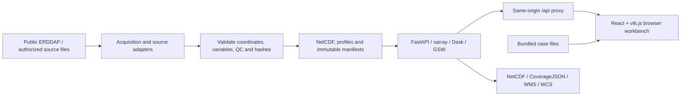

# Ocean3D - Ocean Evidence Workbench

A browser-native ocean visualization and analysis platform for **Smart India Hackathon problem statement SIH26067**. Ocean3D brings three-dimensional model fields, in-situ instrument observations, scientific diagnostics and source evidence into one interactive workspace for oceanographers, forecasters, educators and students.

**README reviewed: 9 September 2026.** This describes the repository implementation. Quantitative validation and source-coverage dates below refer to the recorded **8 September 2026** checks unless stated otherwise; they are not a claim that every feed is current today.

**Project status:** a substantially implemented regional research prototype using real and explicitly labelled synthetic data. Core visualization, ingestion, controls, extensibility and public INCOIS polling work for documented contracts. Native operational model integration, representative institutional deployment and actual forecaster evaluation remain incomplete. See the [requirements matrix](docs/REQUIREMENTS_MATRIX.md), [validation record](docs/VALIDATION_2026-09-08.md) and [completion audit](output/pdf/SIH26067_Completion_Audit.pdf).

[Existing hosted demonstration](https://ocean3d-sih26067.kuttykoncepts1.chatgpt.site) - deployed content can lag this repository. The 8 September record places the latest changes in local builds, with public publication pending. Use the API-connected setup below to evaluate the repository's scientific services.

## Contents

- [Problem and scope](#problem-and-scope)
- [Implemented capabilities](#implemented-capabilities)
- [Data sources and geographic coverage](#data-sources-and-geographic-coverage)
- [Scientific interpretation](#scientific-interpretation)
- [Architecture and technology](#architecture-and-technology)
- [Run locally](#run-locally)
- [Use the workbench](#use-the-workbench)
- [Synchronization and freshness](#synchronization-and-freshness)
- [Ingestion and large archives](#ingestion-and-large-archives)
- [Extending the platform](#extending-the-platform)
- [API and standards](#api-and-standards)
- [Deployment and configuration](#deployment-and-configuration)
- [Reproduce datasets and browser bundles](#reproduce-datasets-and-browser-bundles)
- [Validation and measured limits](#validation-and-measured-limits)
- [Known gaps and completion priorities](#known-gaps-and-completion-priorities)
- [Troubleshooting](#troubleshooting)
- [Repository and documentation map](#repository-and-documentation-map)
- [Development and attribution](#development-and-attribution)

## Problem and scope

INCOIS model outputs and instrument observations span different variables, depths, grids, timestamps and file formats. The requested system lets users inspect those sources together in a web browser, navigate the water column, compare profiles, and retain the evidence behind an interpretation.

The scope includes temperature, salinity, current vectors and additional registered variables; Argo, glider, CTD and BGC observations; NetCDF and delimited text ingestion; interactive colors, depths and time; interoperable services; and outreach. **It is not limited to the Bay of Bengal.** Regional 3D cases cover the Indian Ocean, and the source library includes global surface products where supplied.

The project visualizes and analyzes supplied data. It does not generate operational forecasts, search-and-rescue trajectories or fishery advisories.

## Implemented capabilities

| Area | Repository implementation | Boundary |
| --- | --- | --- |
| 3D scalar fields | vtk.js/WebGL volumes, horizontal slices, intersecting sections, cutaways, marching-tetrahedra isosurfaces, geographic context, depth windows and time playback | Regional rectilinear grids; display sampling does not increase native resolution |
| Current visualization | East/north vectors through the column or at a selected depth; speed/direction profiles; RK4 streamlines and animated particles | Horizontal, fixed-depth, frozen-time paths; no vertical velocity or time-evolving drift prediction |
| Instrument overlays | Argo, glider, CTD and BGC markers, native depth charts, timestamps, source links, independent observation variables, QC policies and per-sample matching where supported | Historical real examples; source-specific layouts and scientific compatibility determine what can be compared |
| Color and view controls | Thermal, Viridis, Ice and Balance palettes; validated min/max; fit/reset; linear/log scale; independent field/instrument/vector/streamline opacity; 1-600x vertical exaggeration; saved/shared views | Log mode excludes nonpositive values; appearance settings leave native scientific values unchanged |
| Ocean lab | NOAA ETOPO relief, INCOIS thermal layers, cutaway/probe views, native-profile curtains, monthly isotherm-depth change, regional presets and local-observation support filters | Monthly structural change is not tracked water motion; terrain is contextual |
| Scientific analysis | Native-grid space/depth/time profile matching; bias, MAE and RMSE; exclusions; transects; observation-distance coverage; GSW/TEOS-10 water-column diagnostics | Comparisons require compatible quantities and support; proximity and spread are not calibrated uncertainty |
| Data ingestion | Automatic detection, xarray NetCDF, native instrument readers, long/wide delimited tables, validation preview, hashes, idempotency and restart restoration | Supported contracts and explicit resource budgets, not every NetCDF/vendor layout |
| Synchronization | Scheduled public INCOIS ERDDAP polling, manual checks, versioned publication, source dates, failure retention and restart recovery | Bounded public-source selections while the writable API runs |
| Extensibility | Versioned sensor/model-reader/variable/product packs; mooring, earth-referenced ADCP and HF-radar total-vector contracts; precomputed derived/ML outputs with lineage | Trusted administrator code; no arbitrary plugin execution from uploads, raw beam/radial decoder or ML training service |
| Exchange and outreach | Evidence JSON, paired CSV, native-grid NetCDF, CoverageJSON, WMS/WCS; four interactive lessons and a research dossier | Scientific API required for native API exports and standards services; no completed user study |

The detailed behavior of palettes, logarithmic masking, opacity and saved views is in [COLOR_CONTROLS.md](docs/COLOR_CONTROLS.md). [OCEAN_LAB_NOVELTY.md](docs/OCEAN_LAB_NOVELTY.md) documents the terrain, thermal methods and investigation exports.

## Data sources and geographic coverage

| Source/case | Retained or accessible data | Dates, coverage and meaning |
| --- | --- | --- |
| Public INCOIS ERDDAP | All 16 scientific products indexed at the checked revision: 15 grid products with 86 variables, plus the Indian Argo table; 26,084 time coordinates summed across products | Inventory of this public ERDDAP, not all INCOIS holdings. Historical selections are available through bounded API requests |
| Four INCOIS water-column analyses | Monthly and 10-day Kessler-McCreary and variational analyses; temperature/salinity, plus supported spread/support fields | Full-basin grid: 90 longitudes x 60 latitudes x 24 depths, 30.5-119.5 E and 29.5 S-29.5 N, 5-2,000 m, 1-degree spacing. Latest checked 10-day date: **30 July 2026**; monthly: **15 July 2026** |
| INCOIS Ocean lab / Bay of Bengal case | Native monthly thermal structure and observation counts; separate original Bay of Bengal subset | May-July 2026. Full basin, Arabian Sea, Bay of Bengal, island, equatorial and southern-region presets |
| INCOIS individual Argo table | Bounded days, original raw/adjusted channels and QC; synchronized raw-channel overlay with disclosed thermodynamic conversion | Latest checked timestamp: **23 April 2025, 13:28 UTC**. The retained newest-day cast has 91 raw levels; the table omits position QC and data-mode fields |
| FNMOC HYCOM ESPC-D V02 currents | Matching temperature, salinity and u/v from one fixed forecast run; all 40 source depths to 5,000 m | Initialization **6 September 2026, 12:00 UTC**; valid times **7 September, 12:00/15:00/18:00 UTC**. Horizontal stride 12; retained grid 93 x 123, approximately 0.96 x 0.48 degrees. A fixed forecast snapshot |
| HYCOM/Argo reference | A real regional model subset and two real Argo casts, including a rejected adjusted-data case | Eastern equatorial Indian Ocean, 1 September 2023. The accepted case has 1,001 matched QC-1 levels and temperature RMSE **0.65527 C**; assimilation independence is unknown |
| Additional real instruments | Four native IMOS/UWA SG152 glider casts; four GO-SHIP/CCHDO CTD stations; INCOIS and AOML BGC-Argo profiles | Glider: September 2010; CTD: March-April 2025; BGC-Argo: September 2023. Real historical observations, not simultaneous live missions |
| NOAA ETOPO / Natural Earth | Numeric seafloor/land relief and geographic context | ETOPO 2022 Indian Ocean relief sampled at 0.25 degrees from the original finer source; not model bathymetry or navigational data |
| Analytic demonstrations | Synthetic model fields, example casts, sensor contracts and derived/ML-output fixtures | Explicitly labelled synthetic; used for teaching and deterministic verification |

The four volumetric analyses, surface maps and observations are different product types. Surface SST, winds and satellite chlorophyll are not converted into invented subsurface fields. **No real three-dimensional chlorophyll model is present in the audited catalog**, although real BGC profiles and surface chlorophyll products are included.

Original source files, normalized cases and SHA-256 manifests are retained under `data/`; browser snapshots and downloadable examples are under `web/public/`. A running catalog may also contain imported fixtures or retained generations, so its model count is not a count of independent operational feeds.

Primary links: [INCOIS ERDDAP](https://erddap.incois.gov.in/erddap/info/index.html), [HYCOM forecast runs](https://tds.hycom.org/thredds/catalog/FMRC_ESPC-D-V02_uv3z/runs/catalog.html), [Argo data guidance](https://argo.ucsd.edu/data/how-to-use-argo-files/). Product-specific requests, source identifiers, licenses and hashes are linked in [INCOIS coverage](docs/INCOIS_COVERAGE.md), [current data](docs/CURRENTS.md) and [instrument overlays](docs/INSTRUMENT_OVERLAYS.md).

An optional acquisition CLI supports the Copernicus Marine Toolbox and authorized GDAC files. Copernicus access requires its separate toolbox/account workflow; a connected operational Copernicus feed is not claimed. The statement's [GLORYS12V1 product](https://data.marine.copernicus.eu/product/GLOBAL_MULTIYEAR_PHY_001_030/description) is a reanalysis product.

## Scientific interpretation

- **Temperature definitions remain distinct.** Canonical `temperature` means potential temperature at 0 dbar. Supported native in-situ observations and HYCOM temperature are converted with GSW using the required salinity, pressure/depth and position. INCOIS `analyzed_temperature` retains its unspecified thermodynamic convention and is not silently used as potential temperature.
- **Matching uses native data.** Model-observation calculations use source coordinates and each observation's timestamp, not the selected display-frame time or rounded WebGL grid. Samples outside valid geographic/depth/time support, missing contributing cells and excessive time gaps do not extrapolate. The default model time-gap limit is 48 hours.
- **Quality policy is explicit.** Canonical comparisons accept QC 1 in strict mode and QC 1/2 in lenient mode. Native flags are mapped by source meaning. The separate public ERDDAP observation chart uses its documented source filter; its labels must not be interpreted as the same policy as every comparison view.
- **Adjusted data are not guessed.** GDAC A/D parameters require adjusted data and its QC; missing adjusted arrays do not trigger a silent raw fallback. The synchronized public INCOIS overlay explicitly selects the raw channel because its source contract lacks data-mode metadata. Original channels and flags remain available.
- **Diagnostics report support and failures.** GSW/TEOS-10 calculations include density mixed-layer depth, thermal departure, signed barrier-layer separation, N-squared and threshold sensitivity. Native crossing brackets and gaps are retained; an unsupported or unreached crossing is unavailable, not zero. Sensor errors are not propagated into a total uncertainty estimate.
- **Rendering conventions are visible.** Depth exaggeration, display interpolation, current-arrow conventions and animated particles are visual aids. Streamlines hold depth and time fixed. Missing cells remain missing; log rendering masks zero/negative samples.
- **Evidence has limits.** Analysis spread, local support counts, observation distance and one-cast RMSE are not independent forecast-skill or confidence estimates. Geographic co-display does not guarantee a scientifically valid comparison.

The integration and reproducible evidence workflow are the project's contribution. Browser ocean visualization has established prior art, including [MBARI STOQS](https://www.mbari.org/data/stoqs-data/); no world-first, operational-accuracy or SIH-winning claim is made. See [research](docs/RESEARCH.md) and its [claim/source ledger](docs/CLAIM_SOURCE_LEDGER.md).

## Architecture and technology



| Layer | Technology and role |
| --- | --- |
| Application | React 19, TypeScript, Tailwind CSS, Recharts and existing UI components |
| 3D rendering | vtk.js/WebGL, persistent renderer/actors, custom section/isosurface/current geometry |
| Scientific API | Python 3.11, FastAPI and Uvicorn |
| Data/science | xarray, netCDF4, NumPy, SciPy, Dask and GSW/TEOS-10 |
| Persistence | Original files, JSON manifests, SHA-256 verification and atomic publication; no shared transactional database |
| Portable frontend | Vite; development proxy and static self-hosted build |
| Bundled demonstration | Vinext/Vite with Cloudflare Worker-compatible output |
| Institutional deployment recipe | nginx plus Docker Compose; writable single worker or immutable read-only workers |

Python versions are pinned in `requirements.lock.txt`; JavaScript versions are resolved by `web/package-lock.json`. Optional acquisition/validation utilities have separate requirements. The existing technology stack is retained.

The browser needs a modern WebGL-capable environment and access to the application assets. End users do not install Python, Node.js, desktop visualization software or browser plugins. The Python scientific backend is a separate service; the standalone Worker does not run it.

## Run locally

### Prerequisites

- Python **3.11** and Node.js **22.13 or newer**, with npm.
- `curl` with trusted CA certificates for upstream acquisition (`curl.exe` on Windows).
- Free local ports **3000** and **8000** for the default API-connected setup.
- Network access for dependency installation and new upstream requests. Retained snapshots can be explored without downloading new source data.

### Windows: API-connected workbench

Run from the repository root:

```powershell
python -m venv .venv
./.venv/Scripts/python.exe -m pip install -r requirements.lock.txt
Set-Location web
npm ci
Set-Location ..
./start.ps1
```

Open [Ocean3D](http://127.0.0.1:3000/). API documentation is at [API docs](http://127.0.0.1:3000/api/docs); [readiness](http://127.0.0.1:3000/api/ready) reports startup status and capabilities.

`start.ps1` selects one writable API worker on `127.0.0.1:8000`, enables six-hour synchronization unless explicitly disabled, and runs the portable frontend. API logs go to `api.log` and `api-error.log`. The launcher stops its API helper when the frontend exits.

For retained data without automatic polling, set this before launching:

```powershell
$env:OCEAN_SYNC_ENABLED = 'false'
./start.ps1
```

Alternatively, run separate terminals. Direct Python startup defaults to polling disabled:

```powershell
# Terminal 1, repository root
$env:OCEAN_SYNC_ENABLED = 'true'
./.venv/Scripts/python.exe -m backend.server
```

```powershell
# Terminal 2, repository root
Set-Location web
npm run dev:selfhost
```

### Linux/macOS: same portable application

```sh
# Repository root: install once
python3.11 -m venv .venv
.venv/bin/python -m pip install -r requirements.lock.txt
cd web
npm ci
cd ..
# Terminal 1
OCEAN_SYNC_ENABLED=true .venv/bin/python -m backend.server
```

```sh
# Terminal 2, repository root
cd web
npm run dev:selfhost
```

The code supports this server/browser architecture; the dated local validation was performed on Windows, not an exhaustive operating-system matrix.

### Standalone bundled demonstration

```sh
# From web/, after npm ci
npm run build
npm run start -- --port 3001
```

Open [the bundled preview](http://127.0.0.1:3001/) while that process runs. `npm run dev` is the corresponding Vinext development command. Use `npm run dev:selfhost` for the API-connected application.

The bundled mode provides retained cases, teaching content and prepared evidence. Uploads, arbitrary scientific queries, synchronization and WMS/WCS require the Python API. The portable application reports API connection failures explicitly instead of replacing its scientific catalog with synthetic data.

## Use the workbench

| Workspace | Main task |
| --- | --- |
| **Ocean lab** | Explore basin/regional thermal layers over terrain, probe native brackets, inspect monthly change and export the investigation |
| **Explorer** | Choose a model/variable; rotate, slice or contour the field; adjust depth/time/color; inspect currents and instruments |
| **Data catalog** | Review provenance, discover installed adapters/extensions, preview/import files and open scientific service exports |
| **INCOIS sources** | Browse public products and exact source dates/depths, request bounded historical selections, check freshness and open water-column products in 3D |
| **Learn** | Follow four interactive lessons on depth, isosurfaces, currents and observation quality |
| **Research & methods** | Read scientific rationale and run the local timed evaluation recorder |

A useful SIH demonstration:

1. In **Ocean lab**, select the full Indian Ocean or Arabian Sea. Probe a thermal layer, switch to monthly change, inspect the two native crossing brackets and enable the local-observation filter.
2. In **INCOIS sources**, show publication dates and native grid/depths. Open a water-column product in 3D; explain the difference between native resolution and visual interpolation.
3. In **Explorer**, exercise volume, sections and isosurface modes, full-depth navigation, time playback, palette/range/log controls and layer opacity.
4. Open **Real current circulation**. Inspect multiple depths, initialization and valid time, then explain the fixed-depth/frozen-time streamline convention.
5. Open **Real instrument overlays** or the reference comparison. Click a cast, change its observation variable/QC policy and inspect timestamps and exclusions. An unsupported model match must remain unavailable.
6. Export evidence and show **Learn** or the evaluation recorder. The reference RMSE describes one historical cast, not general forecast skill.

## Synchronization and freshness

The writable service checks public INCOIS ERDDAP while it runs. `start.ps1` and writable Compose enable polling; direct Python launches require `OCEAN_SYNC_ENABLED=true`. The default interval is **21,600 seconds (six hours)**, with a permitted range of one hour to seven days.

Use **INCOIS sources -> Source freshness -> Check INCOIS now** for a manual check. After publication, **Load updated source catalogue** explicitly adopts the new revision. Repeated/overlapping manual checks can return 409 during the 60-second retry interval.

A cycle updates metadata/axes and bounded product packets. The current implementation retains up to three recent frames and all 24 native depths for the four analyses, latest surface selections, and an Argo window relative to the source's published end date. Historical axes remain available for bounded on-demand selection.

Source NetCDF requests are limited to 32 MiB, with a separate 512 MiB acquisition cache. Observation requests cover at most seven days and 16 MiB. Opening additional water-column selections is refused when the loaded model catalog reaches 32 entries. These controls make the public integration bounded rather than an unlimited archive mirror.

Generation files and hash manifests persist in `OCEAN_DATA_DIR/.sync`. Atomic pointers, integrity checks and retained previous packets prevent a failed refresh from being reported as fresh data. Source failures remain visible. The process retains up to three serving generations, restores the current generation after restart, and checks a 1 GiB synchronization storage budget before acquisition.

**Successful retrieval does not make old observations current.** The checked public sources end on the dates in the data table. This scheduler does not refresh HYCOM, activate institutional glider/CTD/BGC feeds, install an OS startup service or provide distributed scheduling. Static browser bundles and Ocean lab's prepared monthly atlas are separate from the running API's published generations.

[SYNCHRONIZATION.md](docs/SYNCHRONIZATION.md) is the current operating guide. Earlier source-coverage/architecture notes describe pre-scheduler snapshots; their statements that scheduling was absent are superseded by the synchronization implementation and final validation section.

## Ingestion and large archives

### Supported contracts

| Input | Required shape/meaning |
| --- | --- |
| NetCDF 3/4 model | Regional one-dimensional longitude, latitude, physical depth and Gregorian time; registered variables with compatible units/definitions |
| Argo GDAC | Supported core/BGC profile layouts, parameter data modes, raw/adjusted values, pressure and QC |
| CF discrete sampling | Profile, trajectoryProfile and timeSeriesProfile with documented orthogonal, incomplete or ragged layouts |
| IMOS glider / CCHDO CTD | Dedicated native readers preserving sample metadata and source quality semantics |
| Delimited text | Long or wide CSV, TSV, semicolon, pipe or whitespace tables; documented headers, coordinates, timestamps, variables, units and quality |

Use **Data catalog -> Bring your ocean data**: choose a file, review the detected adapter/validation report, then add the validated dataset. A preview does not register it. Import repeats validation, stores source bytes/hash/manifest and restores compatible imports after restart.

A minimal, explicitly synthetic long-format example:

```csv
profile_id,instrument,longitude,latitude,time,depth,variable,value,unit,qc,synthetic
EXAMPLE-CTD,CTD,85,14,2026-07-15T00:00:00Z,10,temperature,28.2,degC,1,true
```

Here `temperature` follows Ocean3D's potential-temperature contract. Do not use that name to relabel an unconverted vendor in-situ measurement. [INGESTION.md](docs/INGESTION.md) defines required columns, aliases, wide tables, unit conversion, sample-varying coordinates and limits; it supersedes older minimal text examples.

Browser/API uploads are capped at **50 MiB**, with up to **10,000 observation profiles** and **200,000 delimited values**. Additional decoded-output and native-layout budgets apply. Curvilinear, terrain-following/sigma, projected, staggered and non-Gregorian model files require a reviewed adapter or upstream conversion; renaming coordinates is insufficient.

### Automated inbox and immutable archives

`python -m scripts.ingest_inbox <inbox> --endpoint http://127.0.0.1:8000` consumes producer-completed files with `.ready.json` sidecars containing adapter kind and SHA-256. It preserves source files, records receipts and uses idempotent imports. Schedule this one-shot command through institutional infrastructure when needed.

Large models can use an administrator-mounted archive instead of browser upload:

```powershell
# Replace these example paths with existing, compatible source files.
./.venv/Scripts/python.exe -m scripts.mount_archive --output C:/ocean/archive/archive.json --id regional-archive --title "Regional model archive" C:/ocean/archive/day01.nc C:/ocean/archive/day02.nc
$env:OCEAN_ARCHIVE_MANIFEST = 'C:/ocean/archive/archive.json'
./.venv/Scripts/python.exe -m backend.server
```

Files must agree on normalized spatial grid/variables, have non-overlapping supported times, pass checksum validation and remain immutable while served. Dask performs bounded lazy reads. Archive limits include 32 archives, 512 listed files per archive, 100,000 coordinate values and a 32 MiB compressed storage-chunk guard. See [SCALING.md](docs/SCALING.md).

## Extending the platform

Discovery endpoints `/api/adapters` and `/api/extensions` drive the import interface.

- **New scalar:** configure an administrator-owned `OCEAN_VARIABLE_MANIFEST`, using [variables.example.json](config/variables.example.json). IDs, units, aliases, ranges and reviewed standard names feed ingestion, controls and exports. New physical conversions and diagnostics still need appropriate code.
- **New source or sensor:** install a versioned `OCEAN_EXTENSION_MODULES` pack registering sensor geometry and an observation/model reader. Model readers must return the supported normalized grid; genuinely new sensor geometry may require a renderer change.
- **Derived or ML field:** register a product and ingest its precomputed NetCDF outputs with version, generation time, input hashes, validation and limitations. ML lineage additionally declares artifact hash, training data and inference domain. Those producer claims are structurally checked, not independently verified.
- **Current sensor examples:** moorings are fixed-depth time series; ADCP inputs are already earth-referenced depth-bin velocities; HF radar inputs are already total surface vectors. Raw beam rotation, vessel correction and radial-to-total inversion are upstream tasks.

Pack registration rolls back on failure; stored imports retain adapter versions and reject mismatched restoration. Plugins are trusted server code, never installed by an uploaded file. The default example-product pack demonstrates an ML-output contract with synthetic values; it does not train or execute a model. The legacy observation-only `OCEAN_ADAPTER_MODULES` hook remains supported.

[EXTENSIBILITY.md](docs/EXTENSIBILITY.md) contains the pack API, example files, lineage schema and restoration rules.

## API and standards

The running API's [OpenAPI schema](http://127.0.0.1:3000/api/openapi.json) is the detailed parameter reference. Below, all paths are relative to the application origin.

| Method | Path(s) | Purpose |
| --- | --- | --- |
| GET | `/api/health`, `/api/ready`, `/api/runtime` | Liveness; startup/restoration readiness; per-worker cache/admission/deployment counters |
| GET | `/api/catalog`, `/api/adapters`, `/api/extensions` | Loaded models/profiles, supported formats, variables and installed packs |
| GET | `/api/volume`, `/api/volume.bin` | Bounded JSON or OCV1 float32 display frames; model, variable, index, resolution, depth window and bounding box |
| GET | `/api/profiles/{id}`, `/api/coverage`, `/api/diagnostics` | Observation comparison, distance/support heuristics and water-column physics |
| POST | `/api/transect` | Model section between longitude/latitude endpoints |
| GET | `/api/export/subset.nc`, `/api/export/column.covjson` | Native-grid selected field or CoverageJSON vertical column |
| POST | `/api/import/inspect`, `/api/import` | Multipart `file`, optional `kind=auto`; validation preview or persistent import |
| GET | `/api/incois/catalog`, `/api/incois/grid`, `/api/incois/observations` | Public-source metadata and bounded grid/profile acquisition |
| POST | `/api/incois/open` | Open one supported historical source time as a 3D model |
| GET / POST | `/api/sync/status` / `/api/sync/run` | Inspect synchronization or queue a refresh |
| GET | `/api/sync/snapshot/{revision}/{product}` | Retained source-generation packet |
| GET | `/api/ogc/wms`, `/api/ogc/wcs` | Versioned map and coverage operations |
| GET | `/api/docs`, `/api/openapi.json` | Interactive documentation and machine-readable API schema |

Binary frames start with `OCV1`, a little-endian metadata length, padded UTF-8 metadata and little-endian float32 samples; NaN represents missing data. The browser validates dimensions and encoding. Display transport is separate from native scientific calculations and exports.

**WMS 1.3.0:** GET GetCapabilities, PNG GetMap and JSON GetFeatureInfo; one layer, EPSG:4326 or CRS:84, exact advertised time/elevation. EPSG:4326 BBOX uses latitude/longitude order; CRS:84 uses longitude/latitude. Elevation is negative depth.

**WCS 1.0.0:** GET GetCapabilities, DescribeCoverage and native NetCDF GetCoverage; one advertised variable/depth coverage, geographic bounding box and exact time. Interpolation is `none`; requested reprojection/resampling is rejected.

CF-aware normalization, CF-described NetCDF and schema-tested CoverageJSON are implemented within supported contracts. XML schema checks and targeted protocol tests are not full OGC certification. OPeNDAP serving, OGC EDR and WCS 2.x are not implemented; REST satisfies the statement's REST/OPeNDAP alternative. See [service contracts](docs/EXTENSIONS_AND_SERVICES.md).

## Deployment and configuration

### Docker Compose recipes

```sh
# Repository root: one writable API worker, nginx on loopback port 8080
docker compose config --quiet
docker compose up --build -d
```

Open [the self-hosted application](http://127.0.0.1:8080/). The API runs as a non-root user; imports and synchronization generations persist in the named `ocean-data` volume. API port 8000 is not published by Compose.

For a prepared, immutable snapshot:

```sh
docker compose -f compose.yaml -f compose.readonly.yaml config --quiet
docker compose -f compose.yaml -f compose.readonly.yaml up --build -d
```

The overlay defaults to two read-only workers and disables uploads/upstream acquisition. **Stop writers before serving their files as an immutable snapshot.** These overlays replace the service mode; they do not create a concurrent writer/replica pipeline. The optional `compose.archives.yaml` mounts `OCEAN_ARCHIVE_DIR/archive.json` and its files read-only.

Compose configuration and actual Windows two-worker operation were checked. Docker image/container/nginx execution was **not** validated because the local Docker engine was unavailable in the recorded run. Institutional TLS, sign-in, storage and workload acceptance remain necessary.

### Settings

Set environment variables in the service's launch environment before startup. Values in an arbitrary `.env` file are not automatically loaded by the direct Python launcher; Compose interpolation and container environment injection are separate concerns.

| Setting | Default / role |
| --- | --- |
| `OCEAN_MODE` | `writable`; alternatively `readonly` |
| `OCEAN_WORKERS` | 1; writable requires exactly 1, read-only allows 1-8; read-only Compose defaults to 2. `WEB_CONCURRENCY` is the launcher fallback |
| `OCEAN_HOST`, `OCEAN_PORT` | Direct launcher `127.0.0.1:8000`; API image binds `0.0.0.0:8000` |
| `OCEAN_MAX_ACTIVE` | 6 scientific requests per worker; allowed 1-32 |
| `OCEAN_DATA_DIR` | `data/imports` locally; `/app/data/imports` in Compose |
| `OCEAN_SYNC_ENABLED`, `OCEAN_SYNC_INTERVAL` | Direct launch `false`; writable launcher/Compose `true`; 21,600 seconds; read-only disables polling |
| `OCEAN_ARCHIVE_MANIFEST` | Optional immutable archive manifest path |
| `OCEAN_ARCHIVE_DIR` | Host directory required by the archive Compose overlay |
| `OCEAN_VARIABLE_MANIFEST` | Optional administrator scalar definitions |
| `OCEAN_EXTENSION_MODULES` | Additional installed packs; defaults to `backend.extensions.example_product`. Empty disables that example; core sensor/product packs remain |
| `OCEAN_ADAPTER_MODULES` | Legacy installed observation-adapter modules |
| `OCEAN_API_TOKEN` | Optional backend bearer token; no token required by default |
| `OCEAN_ORIGINS` | CORS allowlist; defaults to localhost/127.0.0.1 on ports 3000 and 5173 |
| `OCEAN_API_UPSTREAM` | Portable Vite development/preview proxy target; default `http://127.0.0.1:8000`; does not rewrite nginx configuration |
| `OCEAN_API_MEMORY`, `OCEAN_API_CPUS` | Compose API budget: `2g`, `2` |
| `OCEAN_HTTP_BIND`, `OCEAN_HTTP_PORT` | Compose published interface: `127.0.0.1`, `8080` |

The supplied Compose configuration forwards only its declared settings; optional tokens, manifests and installed extension packages need explicit institutional deployment configuration.

Place TLS, sign-in and authorization at a trusted gateway. If using `OCEAN_API_TOKEN`, inject it server-side after authentication; never put it in browser code. Health/readiness remain unauthenticated, while other API routes are protected when the token is configured. Swagger UI uses FastAPI's default CDN assets; the scientific frontend and local OpenAPI JSON do not depend on those documentation assets.

The service uses bounded admission and per-process scientific-read locking. Excess work receives 503 with `Retry-After`; this is not a durable job queue. Server encoded-frame cache: **64 MiB / 128 entries per worker**. Browser decoded-frame cache: **48 MiB / 24 entries**, excluding renderer/GPU memory. Analysis and native export limits are **8 million** and **2 million** cells; display frames are bounded to **393,216** cells. Workers own separate memory and caches.

[DEPLOYMENT.md](docs/DEPLOYMENT.md) covers gateway behavior, readiness, probes, snapshot promotion and the unverified target-environment requirements.

## Reproduce datasets and browser bundles

**Normal startup uses retained data and does not require regeneration.** Acquisition utilities may access upstream services and rewrite generated files. Stop API readers before replacing their source files, preserve original manifests, and rebuild the frontend after changing browser bundles. Fixed historical URLs may cease to be available upstream.

Run from the repository root with the scientific virtual environment. The order matters: `backend.demo` rewrites the base bundled catalog, so later additions must follow it.

```powershell
./.venv/Scripts/python.exe -m scripts.bootstrap_reference
./.venv/Scripts/python.exe -m scripts.bootstrap_incois
./.venv/Scripts/python.exe -m backend.demo
./.venv/Scripts/python.exe -m scripts.export_thermal_atlas
./.venv/Scripts/python.exe -m scripts.bootstrap_incois_catalog
./.venv/Scripts/python.exe -m scripts.bootstrap_currents
./.venv/Scripts/python.exe -m scripts.bootstrap_instruments
```

This prepares the base real cases, base browser fixtures, Bay thermal packet, full-basin/source-library additions, fixed current case and instrument overlays. It does not create a synchronized operational feed or regenerate imported user datasets.

| Utility | Purpose / requirement |
| --- | --- |
| `python -m scripts.inventory_incois` | Retained public metadata inventory; `--refresh` requests new metadata |
| `python -m scripts.bootstrap_incois_catalog --refresh` | Explicit stopped-service catalog/axis and browser-snapshot refresh; distinct from API synchronization |
| `python -m scripts.bootstrap_relief`, `python -m scripts.bootstrap_indian_relief` | NOAA numeric relief preparation; install optional `requirements-data.txt` for Pillow |
| `python -m scripts.build_cf_example` | Regenerate the labelled synthetic CF glider example |
| `python -m scripts.extension_examples --output tmp/extension-examples` | Generate labelled sensor/derived-output fixtures |
| `python -m scripts.acquire_data --help` | Authorized GDAC file or Copernicus subset acquisition; Copernicus requires the optional `copernicusmarine` package and its authentication |
| `python -m scripts.mount_archive --help` | Build an administrator archive manifest |
| `python -m scripts.ingest_inbox --help` | Inspect repeatable producer-file ingestion options |

Commands using plain `python` assume the virtual environment is active. The upstream scripts preserve source requests/hashes where documented; changing a source requires re-verifying values, metadata and scientific definitions, not only rebuilding the screen.

## Validation and measured limits

### Reproduce checks

```powershell
# Repository root
./.venv/Scripts/python.exe -m pytest -q
./.venv/Scripts/python.exe -m scripts.benchmark

Set-Location web
npm run typecheck
npm run lint
npm run test:science
npm run build:selfhost
npm run build
```

`npm run build:selfhost` produces `web/selfhost-dist`; `npm run build` produces the Worker build under `web/dist`. Tests cover analytic interpolation/current behavior, missing masks, source semantics, QC, ingestion, extensions, exports, synchronization failure/recovery and deployment contracts. Source preparation commands are separate from these checks.

For the optional OGC XML check, export fixtures with `python -m scripts.export_ogc_validation`, then use `python scripts/validate_ogc_xml.py --fetch` in a validation environment containing `lxml`. The flag obtains the official schema cache; later checks can omit it. This is not an API runtime dependency or full standards-conformance certification.

### Recorded evidence

| Check | Recorded result | Interpretation |
| --- | --- | --- |
| Latest frontend checks | 41 scientific tests, typecheck, lint and both builds passed | Dated local validation; not a guarantee across every browser/GPU |
| Latest synchronization/evaluation backend run | 14 tests passed in 58.21 s; other targeted suites passed separately | Suites overlap; do not sum them or claim one clean final full-repository run |
| Public acquisition/recovery | All 16 products acquired; initial cycle 35.31 s; restarts restored 14 models and 29 records with zero restoration errors | Includes retained cases/imports; successful historical publication, not current ocean coverage |
| Local HTTP load | 3,134 successful requests across 1/2/4 clients; four-client p95 50.47 ms; consistent frame hashes | Roughly 30 seconds, three small synthetic frames, mostly cached; not sustained production/GPU capacity |
| Lazy archive | 1.5 GiB logical synthetic scalar archive; about 304 MiB process peak; 0.307 s full-region / 0.235 s smaller-region median | One process and documented chunk layout; logical size differs from compressed source bytes |
| Multi-worker behavior | Two real read-only Windows workers; matching binary outputs and rejected mutations | Not cross-host failover, container acceptance or distributed writes |
| Browser interactions | Volumes, overlays, colors, import workflows, source refresh, evaluation recorder, outage/recovery and selected mobile checks recorded | Checks are dated and feature-specific |
| Human evaluation | Protocol and developer-practice flow exist; no actual forecaster participants | No measured improvement in operational speed or accuracy |

Known dependency deprecation/NumPy ABI warnings and frontend chunk/future JSON-import warnings are recorded in the validation notes; no claim of a warning-free environment is made.

Optional measurement tools:

```sh
python -m scripts.benchmark_scale --prepare
python -m scripts.benchmark_scale
python -m scripts.check_deployment --base-url http://127.0.0.1:8080 --mode writable --workers 1 --output tmp/deployment-check.json
python -m scripts.load_acceptance --base-url http://127.0.0.1:3000 --seconds 10 --clients 1,2,4 --output tmp/http-load.json
```

Benchmark preparation creates synthetic files; service probes require the chosen service to be running. Test capacity against representative institutional workloads with agreed thresholds.

The [forecaster evaluation protocol](docs/FORECASTER_EVALUATION.md) defines fixed tasks, pseudonymous recording, independent scoring, counterbalanced comparisons and exclusions. `scripts.analyze_evaluation` analyzes scored exports and excludes developer practice, unscored and unmatched trials. It does not manufacture participants or establish population benefit.

## Known gaps and completion priorities

1. **Representative operational INCOIS files and access.** The public ERDDAP inventory does not include every institutional forecast or mission stream. Confirm required variables, geography, update cadence, metadata and access with the data provider.
2. **Native model geometry.** INCOIS describes ROMS configurations with terrain-following vertical coordinates; the generic normalizer currently accepts physical-depth rectilinear grids. A representative export may already be regridded, otherwise it needs verified depth reconstruction, regridding and any required vector/stagger handling. [INCOIS model description](https://iioe-2.incois.gov.in/site/datainfo/modelling/ecosystem.jsp).
3. **Complete synchronized cases.** Real 3D chlorophyll, refreshed HYCOM currents and institutional glider/CTD/BGC streams are not integrated as a complete continuously updated operational case.
4. **Institutional deployment and scale.** Validate containers/nginx, identity/TLS, storage, representative GPU/browser hardware, sustained concurrent use, backups and recovery. No distributed writable registry, queue, automatic snapshot promotion or cross-host failover is implemented.
5. **Scientific and human acceptance.** Independently verify representative source-to-display values and matched quantities, test interoperability with intended clients, and measure practitioner task correctness and time. Educational usability and broad accessibility also require evaluation.

A globe renderer, trained ML model, new forecasting engine or every CF geometry is not automatically required by the statement. Completion should be judged against agreed source contracts and acceptance criteria. The current work does not establish operational certification or guarantee an SIH result.

## Troubleshooting

| Symptom | Check / action |
| --- | --- |
| Port 3000 or 8000 is occupied | Use the intended existing service or stop the process you own. The portable dev server uses a strict port. For a changed API port, set `OCEAN_PORT` and matching `OCEAN_API_UPSTREAM`; `start.ps1` deliberately selects 8000 |
| Scientific connection fails | Check `/api/health`, then `/api/ready`, API logs and proxy target. Use **Retry connection** after resolving the cause |
| 401 response | Configure the trusted gateway's bearer-token forwarding; do not paste server secrets into frontend code |
| 403 on import/acquisition | The API is read-only. Use the single writable ingestion service and publish an immutable snapshot |
| 409 on manual synchronization | A check is queued/running or the retry interval has not elapsed. Inspect `/api/sync/status`; the UI also reports catalog-capacity limits separately |
| 413 / oversized data | Subset upstream or mount a supported immutable archive; the upload limit is 50 MiB |
| 422 validation error | Inspect the reported coordinates, units, variable definition, layout or time bounds. Do not hide a sigma grid or in-situ temperature by renaming it |
| 503 readiness or capacity | Readiness indicates startup/restoration failure; capacity includes `Retry-After`. Inspect the body/logs, reduce request load or fix restoration |
| Checksum or adapter-version mismatch | Restore the verified source/pinned adapter or perform a reviewed migration. Do not bypass the manifest check |
| A variable/profile/match is absent | Check source availability, selected region/depth, QC, temperature meaning and temporal support. The application does not fabricate missing values |
| Log view appears empty | Use a positive range/quantity or linear scale; nonpositive values and isovalues are hidden in log mode |
| Upstream request fails | Confirm HTTPS/curl/CA availability and inspect the source-specific error. Last valid data can remain visible with its original date |
| Bundled demo lacks a new dataset | Rebuild after source export and follow the regeneration order; `backend.demo` resets the base catalog |
| API docs do not load offline | Swagger assets use a CDN. Use `/api/openapi.json`; scientific exploration does not depend on Swagger |
| Docker cannot reach its engine | Start/configure the local Docker engine or use the direct Python/Vite setup; a valid Compose file alone does not prove a running deployment |

## Repository and documentation map

```text
backend/            API, normalization, adapters, science, exports, sync and plugins
  extensions/       Core sensors/products and the synthetic product example
web/                React workbench, vtk.js rendering and both frontend builds
  app/              Application orchestration and styles
  components/       Explorer, Ocean lab, imports, sources, lessons and inspectors
  lib/              Numerical rendering, transport, profiles, colors and view state
  content/          Research dossier source
  public/           Bundled fields, source evidence, geography and examples
  tests/            Frontend scientific tests
data/               Original/normalized scientific cases and source manifests
scripts/            Acquisition, export, ingestion, archive and verification CLIs
tests/              Backend scientific/API/integration tests and schemas
config/             Example administrator variable definitions
deployment/         nginx configuration
docs/               Methods, contracts, operations and dated validation
  benchmarks/       Machine-readable measured results
output/pdf/         Completion audit
compose*.yaml       Writable, immutable read-only and archive deployment recipes
start.ps1           Windows API + portable frontend launcher
requirements*.txt   Python lock, compatibility ranges and optional data utility
```

| Read next | Subject |
| --- | --- |
| [Requirements matrix](docs/REQUIREMENTS_MATRIX.md) / [completion audit](output/pdf/SIH26067_Completion_Audit.pdf) | Functional coverage and delivery gaps |
| [Architecture](docs/ARCHITECTURE.md) | Component responsibilities and trust/resource boundaries |
| [Scientific data contract](docs/DATA_CONTRACT.md) | Variables, native calculations, source semantics and exports |
| [Ingestion](docs/INGESTION.md) | Current file detection, text/NetCDF schemas, validation and limits |
| [INCOIS coverage](docs/INCOIS_COVERAGE.md) / [synchronization](docs/SYNCHRONIZATION.md) | Source inventory versus current polling/publication behavior |
| [Current data](docs/CURRENTS.md) / [instrument overlays](docs/INSTRUMENT_OVERLAYS.md) | Source cases, geometry, QC and scientific limits |
| [Color controls](docs/COLOR_CONTROLS.md) / [Ocean lab methods](docs/OCEAN_LAB_NOVELTY.md) | View semantics, terrain and thermal analysis |
| [Extensibility](docs/EXTENSIBILITY.md) / [services and classroom](docs/EXTENSIONS_AND_SERVICES.md) | Packs, sensor/product contracts, WMS/WCS and lessons |
| [Deployment](docs/DEPLOYMENT.md) / [scaling](docs/SCALING.md) | Operating modes, settings, archives, benchmarks and acceptance |
| [Latest validation](docs/VALIDATION_2026-09-08.md) / [earlier validation](docs/VALIDATION.md) | Executed checks with their dates and limitations |
| [Forecaster evaluation](docs/FORECASTER_EVALUATION.md) | Study protocol, recording and analysis |
| [Research](docs/RESEARCH.md) / [claim-source ledger](docs/CLAIM_SOURCE_LEDGER.md) | Rationale and primary references |
| [Implementation plan](docs/IMPLEMENTATION_PLAN.md) | Historical planning context; not a current completion checklist |

Some documents retain chronological implementation notes. Use current code, the final validation sections and the specialized ingestion/synchronization guides for current behavior. Historical plans and earlier absence-of-feature statements are not completion evidence.

## Development and attribution

Keep changes within the supported scientific contracts. Preserve source values, missing masks, units, dates, original files and explicit synthetic labels. New adapters or calculations should have meaningful source-contract/analytic regression checks; update their documentation and run the relevant backend/frontend checks before changing a published case. Never turn missing or incompatible observations into a successful comparison.

Application code is licensed under the [MIT License](LICENSE), copyright 2026 SUBASH R. Third-party datasets, libraries, maps and schemas retain their own terms and attribution requirements; the repository license does not replace them. Retain source manifests, investigator acknowledgements and dataset links when sharing exports. Argo attribution includes the [Argo dataset DOI](https://doi.org/10.17882/42182); the instrument guide records IMOS/UWA, GO-SHIP/CCHDO, INCOIS and AOML sources, and the research ledger records NOAA/Natural Earth and method references.
