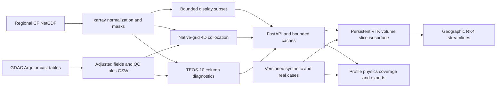

# Architecture and SIH26067 requirement coverage

Updated 8 September 2026. React + VTK.js + FastAPI/xarray retained; no stack replacement.

Versioned extension packs now register sensor geometries, scalar variables, observation/model readers and precomputed derived/ML product definitions. Mooring and HF-radar inspectors use actual sample timestamps; ADCP is split into timestamped depth profiles. Registry discovery drives the import form and extension panel, while shared validation, persistence and exports retain pack versions and product lineage. [Contracts, examples and administrator guide](EXTENSIBILITY.md).

Deployment extension: validated server launcher; separate liveness/readiness; same-origin API documentation; mandatory scientific connection for the portable build; writable single-worker and immutable read-only multi-worker modes. Users install no client packages. [Deployment instructions and executed checks](DEPLOYMENT.md).

Scale extension: lazy immutable multi-file NetCDF archives, source-chunk guards, geographic display subsets, compact frame transport, byte-budgeted caches, bounded request admission, responsive import parsing and large-timeline navigation. [Setup and evidence](SCALING.md).

Instrument extension: native CF DSG profile/mission parsing, GSW conversion for explicitly in-situ temperature, plugin-defined scalar variables, idempotent inbox ingestion, WMS 1.3.0 and WCS 1.0.0 GET services, mission joins, and four interactive classroom lessons. [Full requirement audit](REQUIREMENTS_MATRIX.md) and [configuration/protocol details](EXTENSIONS_AND_SERVICES.md).

Ocean lab revision: a separate lazy-loaded `ThermalAtlas.tsx` workspace uses `AtlasRenderer.tsx` for NOAA terrain, three native INCOIS first-crossing surfaces, paired monthly changes, native-column probing and source-support filtering. `lib/thermal.ts` owns the pure numerical definitions; `scripts/export_thermal_atlas.py` produces exact source arrays and `scripts/bootstrap_relief.py` prepares verified numeric GeoTIFF context. The page-scoped evidence tool follows the active lab/Explorer rather than returning a hidden view. [Methods, novelty and limits](OCEAN_LAB_NOVELTY.md).

INCOIS extension: `scripts/bootstrap_incois.py` downloads a bounded verified-HTTPS ERDDAP snapshot; `backend/incois.py` validates and registers it in both the API and bundled catalog. Original source, metadata, counts and hashes remain under `data/incois`. The source-specific analyzed-temperature and spread variables deliberately bypass potential-temperature diagnostics. `IncoisEvidence.tsx` explains native support and provenance; `lib/sections.ts` supplies mask-aware intersecting-plane geometry and surface normals to the persistent renderer. Top/front cameras use viewport-aware framing. Source-dependent markers and comparison panels prevent synthetic instruments or old metrics from appearing on the INCOIS analysis.

| Requirement | Implemented behavior | Boundary |
| --- | --- | --- |
| True 3D fields | GPU ray-cast volume, independent transfer controls, cutaway, quality setting | Regional equirectangular coordinates; WebGL required |
| Slices and isosurfaces | Nearest displayed depth/latitude labeled; mask-aware marching tetrahedra; degenerate triangles removed | Uniform display resampling is not native resolution |
| Advanced currents | Physical-unit arrows and mask-aware geographic RK4 streamlines with animation | Fixed depth and frozen time; no vertical velocity, forecast pathlines or diffusion |
| Depth detail | Full column and upper-500-m subset with denser vertical display sampling | Native comparisons and diagnostics remain separate |
| Instrument overlays | Selectable profiles, observed depth extent clamped to view, ±24 h freshness indication | Native GDAC core layout and documented generic cast tables |
| Argo/glider/CTD/BGC | GDAC parameter modes; native CF profile/mission layouts, explicit quality and units, in-situ conversion, mission joins; delimited casts | Sample-varying coordinates/times, pressure-only CF and arbitrary complex layouts need adapters |
| Model/observation evidence | Bounded 4D interpolation, QC policies, exclusions, RMSE/MAE/bias | No independent skill claim without assimilation-aware evaluation |
| Physical diagnostics | TEOS-10 sigma0, N², density MLD, absolute thermal departure, signed barrier separation, sensitivity | Threshold diagnostics, not hazard forecasts; large gaps censor results |
| NetCDF/text ingestion | Validated local upload, source hash, manifests and restart persistence | Regional rectilinear Gregorian data; documented CSV/TSV schema |
| Colors, opacity, exaggeration, time | Palettes, linear/log bounds, explicit scales, persistent camera, bounded frame cache | Missing/nonpositive data are not invented; prior frame labeled during fetch |
| Geography | Natural Earth coastline in Explorer; real NOAA ETOPO 2022 terrain in Ocean lab | Independent geographic context; does not change model masks; explicit depth lens; not navigational bathymetry |
| CF and exchange formats | Source normalization, native CF-described NetCDF export, schema-tested CoverageJSON | Not a full CF validator or OGC EDR conformity claim |
| WMS/WCS/OPeNDAP | WMS 1.3 GET capabilities/maps/feature info; WCS 1.0 GET capabilities/descriptions/native depth coverages; official XML schema checks | No WCS 2.0, resampling/reprojection, full certification or OPeNDAP serving |
| Deployment | React portable build, FastAPI REST, same-origin nginx, liveness/readiness, one writable worker or multiple immutable read-only workers; explicit capability/error UI | Two workers verified locally; Docker/nginx execution, institutional identity/TLS, sustained load and cross-host failover require target acceptance |
| Outreach and reproducibility | Four classroom lessons controlling the real scene, questions/feedback, guided journeys, research dossier and exports | Hosted bundle is distinct from the full scientific service; user-study validation remains |
| Extension and incoming files | Versioned sensor/variable/model-reader/product packs; atomic registration, adapter-version restoration checks, lineage; ready-file inbox and idempotent imports | Trusted installed Python; supported regional grids and sensor geometries. No recurring feed, raw beam/radial processing or ML training/inference service |

## Code map

- `backend/science.py`: normalization, positive-weight interpolation and original-bracket display sampling.
- `backend/observations.py`: cast/GDAC adapters, parameter modes, quality, depth and potential temperature.
- `backend/analysis.py`: collocation, statistics, coverage and transects.
- `backend/diagnostics.py`: density, stratification, crossing support and MLD/BLT criteria.
- `backend/exports.py`: CoverageJSON and native-grid NetCDF.
- `backend/reference.py`, `scripts/bootstrap_reference.py`: reproducible real case and source verification.
- `backend/api.py`: bounded API, imports, manifest persistence, optional token gate and LRU cache.
- `backend/server.py`: validated mode/worker/resource settings and Uvicorn launcher.
- `scripts/check_deployment.py`: repeatable readiness, replica consistency and mutation-rejection probe.
- `web/lib/connection.ts`: explicit scientific connection and deployment capabilities.
- `web/components/OceanRenderer.tsx`: owned VTK actors/context, frame updates, actual geography and overlays.
- `web/lib/flow.ts`, `web/lib/isosurface.ts`: numerical visualization geometry.
- `web/components/DiagnosticsPanel.tsx`, `ResearchReport.tsx`: scientific explanation and primary-source dossier.

## Resource and trust boundaries

Uploads are limited to 50 MiB and server-generated file names. Model comparisons cap source subsets at 8 million cells. Native NetCDF exports cap at 2 million cells; diagnostics/column exports cap at 2,000 native depths. Each API worker has a 64 MiB encoded-response cache (at most 128 entries); the browser has a 48 MiB decoded-frame budget (at most 24 entries), excluding additional renderer/GPU memory. Native NetCDF calls are serialized per process. Writable imports use one worker. Multiple read-only workers serve the same immutable snapshot with separate caches and model memory; distributed writes still require a shared transactional registry and job ownership.

No credentials are embedded in the workbench. The hosted page uses bundled case files and does not probe local/private networks. The scientific API uses a same-origin proxy when explicitly configured or run locally. Production authentication and TLS belong at an institutional reverse proxy; an optional API bearer token must be injected server-side after authentication.
