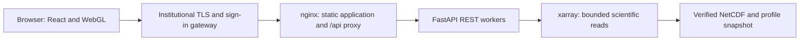

# Institutional web deployment

The requirement is implemented with React 19, VTK.js/WebGL and a FastAPI/xarray REST service. The stack is unchanged. End users open a URL in a modern WebGL-capable browser; Python, Node.js and scientific libraries run on the server. JavaScript, styles and rendering libraries are bundled with the frontend. A browser download of these assets is required, but no plugin, desktop application or client package installation is needed. REST satisfies the problem statement's REST/OPeNDAP alternative; this project does not serve the OPeNDAP protocol.

## Same-origin service



The portable build requires `/api/health`, `/api/ready` and a valid `/api/catalog` before connecting the scientific workbench. An unavailable service, failed restoration or rejected authentication shows an explicit connection error with a retry action. It does not replace the scientific catalog with demo data. The separate Ocean lab and source-library snapshots remain explicitly labelled snapshots. The standalone Worker build remains a bundled demonstration; it is not the Python scientific service.

REST documentation and OpenAPI JSON are at `/api/docs` and `/api/openapi.json`, including through nginx. The JSON schema is served locally; the optional Swagger UI uses FastAPI's default CDN assets and therefore needs internet access. The scientific frontend does not rely on those documentation assets.

| Route | Operational meaning |
| --- | --- |
| `/api/health` | Event loop is alive. Does not assert that all datasets restored. |
| `/api/ready` | 200 only after catalog startup without import-restoration errors; otherwise 503 with `Retry-After: 2`. Includes read/write capabilities. Not a freshness/forecast-quality check. |
| `/api/runtime` | Per-process admission/cache counters, worker mode/PID and startup catalog revision. Optional token protection applies. |
| `/healthz` | nginx itself is serving; independent of scientific readiness. |

The startup catalog revision hashes sorted model metadata and profile identity/source metadata. It helps detect configuration differences across replicas. It is not a complete content hash of synthetic fields, a continuously updated writable catalog version or a substitute for source checksums. Frame responses identify their serving worker in `X-Ocean-Worker` so the deployment probe can compare actual outputs from different workers.

## Writable service

```sh
docker compose config --quiet
docker compose up --build -d
python -m scripts.check_deployment --base-url http://127.0.0.1:8080 --mode writable --workers 1
```

This runs one writable scientific worker, persistent imports in `ocean-data`, and nginx on loopback port 8080. Server startup uses `python -m backend.server`, which validates deployment mode, worker count and resource settings before launching Uvicorn. Writable mode rejects configurations with more than one worker: imports, idempotency and the catalog are process-local. Do not bypass this launcher with a manually configured multi-worker writable Uvicorn command.

The default container budget is 2 GiB and two CPUs for the API, with six admitted scientific requests and a 64 MiB encoded-frame cache per worker. Active arrays and Python overhead require additional memory. Over-capacity requests return 503 and `Retry-After`; this is bounded backpressure, not a durable job queue. Scientific reads are serialized per process for conservative NetCDF access. See [measured archive limits](SCALING.md).

## Read-only workers for an immutable archive

```sh
docker compose -f compose.yaml -f compose.readonly.yaml config --quiet
docker compose -f compose.yaml -f compose.readonly.yaml up --build -d
python -m scripts.check_deployment --base-url http://127.0.0.1:8080 --mode readonly --workers 2
```

Use this mode for a published, immutable snapshot. The overlay defaults to two workers, mounts the import volume read-only, makes the container root filesystem read-only and provides a bounded temporary directory. It disables browser uploads and remote INCOIS acquisition, including GET routes that populate caches. Catalog reads, model frames, profiles, diagnostics, transects and exports remain available. The frontend displays the mode and disables unavailable actions.

Prepare source files through one ingestion service or the archive tools. Stop the writer before starting readers against that snapshot. Never let a writer change files mounted by active read-only workers. For an update, prepare a separate verified snapshot, start readers against it, check readiness and sample consistency, then switch the institutional proxy to the new reader service. Retain the previous immutable snapshot for rollback. Automated snapshot promotion and zero-downtime orchestration are not implemented.

For large time archives, set `OCEAN_ARCHIVE_DIR` to an administrator-owned directory containing `archive.json` and its listed NetCDF files, then also pass `-f compose.archives.yaml`. The directory is mounted read-only. [Archive preparation instructions](SCALING.md) document exact-grid and checksum requirements. In the provided Compose layout, read-only serving replaces the writable service; it does not create a concurrent writer/reader pipeline or distributed transactional registry.

| Setting | Default / constraints |
| --- | --- |
| `OCEAN_MODE` | `writable` or `readonly` |
| `OCEAN_WORKERS` | 1 in writable mode; 1–8 in read-only mode; read-only Compose default 2 |
| `OCEAN_MAX_ACTIVE` | 6 per worker; range 1–32 |
| `OCEAN_API_MEMORY`, `OCEAN_API_CPUS` | Compose API container budget; `2g`, `2` |
| `OCEAN_HTTP_BIND`, `OCEAN_HTTP_PORT` | Compose published interface and port; `127.0.0.1`, `8080` |
| `OCEAN_DATA_DIR` | Persisted import directory; `/app/data/imports` in Compose |
| `OCEAN_SYNC_ENABLED` | `true` in writable Compose/start.ps1; `false` for direct Python launches and read-only overlay |
| `OCEAN_SYNC_INTERVAL` | 21,600 seconds; permitted range 3,600–604,800 |
| `OCEAN_ARCHIVE_MANIFEST` | Optional verified immutable archive manifest path |
| `OCEAN_HOST`, `OCEAN_PORT` | Launcher binding; `127.0.0.1:8000` outside Docker, `0.0.0.0:8000` inside the API image |

Each worker owns its own model arrays, cache and admission counter. Increasing workers increases memory use; eight workers is a configuration limit, not a tested capacity recommendation. This follows [FastAPI's process-memory model](https://fastapi.tiangolo.com/deployment/concepts/) and [Uvicorn's worker settings](https://www.uvicorn.org/settings/). Independent hosts can serve the same immutable snapshot behind an institutional load balancer, but cross-host failover and sustained simultaneous-user capacity still require target testing.

## Gateway and server operation

Configure TLS, institutional sign-in, authorization and request quotas at the institution's gateway. Keep API port 8000 private; Compose does not publish it. Default loopback publication suits a gateway running on the host. Set the published interface deliberately when the gateway runs elsewhere.

An optional `OCEAN_API_TOKEN` environment variable can require a backend bearer token. Pass it securely to the API using the institution's secret mechanism and have the gateway inject it only after authenticating the user. Never embed it in frontend code. The provided Compose file does not configure a secret or institutional sign-in. Health/readiness remain available without the token; other `/api` routes, including the schema, are protected when it is set.

nginx preserves upstream errors and `Retry-After`, uses upstream keep-alive, applies bounded timeouts and returns `X-Request-ID` for correlation. Hashed application assets have long cache lifetimes; HTML and named snapshot data revalidate. [nginx's proxy documentation](https://nginx.org/en/docs/http/ngx_http_proxy_module.html) defines these forwarding behaviors. Health checks inform Compose startup; automatic restart applies to exited processes, not every unhealthy state. Monitoring, backups, host failover and deployment lifecycle management belong to the target operator.

Build with Node.js 22.13+ and Python 3.11 or use the supplied images. Runtime dependencies are locked. Building images needs access to package registries. Browser data exploration of installed snapshots requires only access to the deployed origin; requesting new public INCOIS data requires outbound HTTPS from the writable service. External source links naturally require internet access.

## Executed verification and acceptance boundary

On 8 September 2026 the actual Windows/Uvicorn read-only service ran two workers. The probe observed both catalog/runtime processes and identical binary scalar responses from both frame-serving processes through the same-origin portable preview. Both saw nine models and 23 profiles; mutation attempts returned 403. Browser testing checked disabled imports/acquisition, an explicit 502 outage with no replacement catalog, and recovery using Retry connection. These are functional checks, not a sustained load benchmark.

Run `python -m scripts.check_deployment --help` for the bounded standard-library probe. Use `--output result.json` to retain the tested catalog revision, frame hashes and worker identities. An optional API token is read from the environment without being printed. The probe uses the clearly synthetic `demo-bob` scalar fixture for replica consistency, so it establishes neither forecast accuracy nor independent real-data validation.

Docker Compose configuration is validated locally. The Docker Desktop Linux engine is unavailable on this machine, so image build, nginx/container execution and read-only filesystem behavior inside Linux containers remain unverified. The supplied infrastructure configuration is reviewable, but actual deployment on INCOIS servers still needs the target engine, identity/TLS setup, storage permissions, representative workload and acceptance criteria. No institutional or public-site deployment occurred in this change.

## Public-source scheduling and further acceptance

Writable launch configurations enable six-hour public INCOIS ERDDAP checks. Generation files, manifests and the current pointer persist inside the existing import volume under `.sync`. The frontend reports source dates and refresh failures and explicitly loads published revisions. Read-only configurations disable the scheduler. See [synchronization and recovery](SYNCHRONIZATION.md) for configuration, bounded acquisition, retention and the distinction between polling and a current operational feed.

The [bounded HTTP result](benchmarks/http-load-2026-09-08.json) records local 1/2/4-client testing. Repeat it against the actual institutional proxy with representative workloads and agreed thresholds; it does not replace container acceptance or forecaster evaluation. [The evaluation protocol](FORECASTER_EVALUATION.md) supplies fixed-case timing and assessor scoring without claiming completed human validation.
